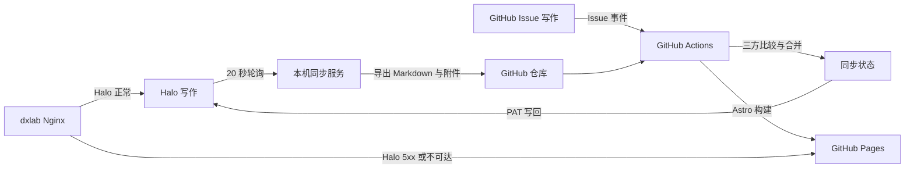

# eH × DxLab

This publication is owned and operated by **eH** under the **eH × DxLab** identity. The collection includes work by multiple contributors; ownership of the site does not replace article-level authorship, so every article retains its original author and writing-source attribution.

`zsyeh.github.io` 的 Astro 静态站点源码。文章可以从 Halo 或 GitHub Issue 写作，两端通过三方状态合并保持同步；GitHub Actions 构建后发布到 GitHub Pages。

- Halo 主站及统一入口：<https://dxlab.ehzsy.space>
- GitHub Pages 独立备用站：<https://blog.ehzsy.space>
- 运行环境：Node.js 22.12 或更高版本

## 同步原理



同步由两条链路组成：

1. 本机 `halo-astro-sync.service` 每 20 秒读取 Halo。公开且已发布的文章被导出为 Markdown，附件保存到仓库；只有内容变化时才提交并推送。
2. GitHub Actions 在推送、Issue 变化和每 5 分钟定时任务中运行双向同步。它比较 GitHub 当前内容、Halo 当前内容与上次共同基线，再决定拉取、写回或执行三方合并。

同步状态文件的职责：

- `src/content/blog/`：Astro 文章 Markdown。
- `public/halo-assets/`：从 Halo `/upload/` 下载的封面和正文附件。
- `.halo-sync.json`：Halo 文章版本签名，用于增量拉取。
- `.sync/state.json`：两端上次同步后的哈希状态。
- `.sync/base/`：三方合并所需的共同基线。
- `.sync/conflicts/`：无法自动合并时生成的冲突记录；解决后需把最终内容写回文章文件并删除冲突文件。
- `public/halo-assets/manifest.json`：图片检索索引，记录文件名、存储位置、原始地址和引用文章。

同一篇文章若只在一端变化，变化会同步到另一端；两端同时修改时会执行三方合并。若同一段内容发生冲突，系统保留原文并生成冲突文件，不会静默覆盖。

每篇文章都记录：

- `author`：Halo 文章使用 Halo 的 `owner.displayName`；GitHub 文章使用 Issue 创建者的 GitHub 登录名。
- `source`：标记首次写作入口为 `Halo` 或 `GitHub`。该来源会写入 Halo annotations，后续往返同步不会丢失。

## 在 Halo 写作

1. 登录 Halo 控制台，新建或编辑文章。
2. 正常填写标题、Slug、摘要、分类、标签、封面和正文。
3. 将可见性设为公开并发布。草稿、私密文章和回收站文章不会进入 Astro。
4. 本机同步服务通常在 20 秒内导出文章并推送 GitHub；GitHub Actions 随后构建 Pages。
5. 在 Halo 中更新文章会覆盖 Astro 的共同基线版本；撤回发布会从 Astro 发布内容中移除该文章。

Halo 作者显示名会作为文章署名，正文与 `/upload/` 附件会一起同步。

## 图片存储与检索

- Halo 的封面及正文 `/upload/` 图片会下载到 `public/halo-assets/`，随 Git 仓库版本化，不依赖 Halo 在线提供图片。
- 在 GitHub Issue 中粘贴或拖入的图片由 GitHub Attachments 托管，正文保留 GitHub 地址。
- `public/halo-assets/manifest.json` 同时索引仓库图片和 GitHub Attachments，支持按文件名、文章标题、Slug、Halo ID、原始地址和存储类型检索。
- Astro 页面只引用 GitHub 仓库或 GitHub Attachments 中的图片；当前同步内容不使用第三方图床。

例如查找某篇文章引用的图片：

```bash
jq '.assets[] | select(.references[].slug == "article-slug")' public/halo-assets/manifest.json
```

## 在 GitHub 写作

1. 打开仓库的 **Issues** 页面，选择 **写文章 / 编辑草稿** 模板。
2. 填写 URL 标识、摘要、分类、标签和 Markdown 正文。图片可以直接粘贴或拖入 Issue 编辑器。
3. 新 Issue 默认带有 `article` 和 `draft` 标签，此时不会公开发布。
4. 准备发布时添加 `published` 标签。工作流会生成 `src/content/blog/github-<Issue 编号>.md`，创建或更新对应 Halo 文章，并部署 Astro。
5. 后续直接编辑 Issue 即可更新文章；移除 `published` 标签或关闭 Issue 会撤回 Astro 内容，并在下一次双向同步中撤回 Halo 文章。

GitHub 文章以 Issue 创建者作为署名，并显示 `WRITTEN ON GITHUB`。自动写回 Halo 需要仓库 Actions Secret `HALO_TOKEN`，该 PAT 必须拥有文章创建、更新、发布和撤回权限。

## 高可用访问

`dxlab.ehzsy.space` 始终是主访问域名。入口 Nginx 优先代理 Halo；当 Halo 上游连接失败、超时或返回 5xx 时，Nginx 在服务端回源 GitHub Pages，浏览器地址仍保持 `dxlab.ehzsy.space`，路径和查询参数不变。

`blog.ehzsy.space` 单独指向 GitHub Pages，可用于直接检查备用站。Astro 的 canonical URL 使用 `dxlab.ehzsy.space`，避免两个域名产生重复收录。

## 本地开发

```bash
npm ci
npm run sync
npm run dev
npm run build
```

手动运行完整双向同步：

```bash
HALO_URL=https://dxlab.ehzsy.space \
HALO_TOKEN='<personal-access-token>' \
REQUIRE_HALO_TOKEN=1 \
npm run sync:bidirectional
```

不要把 PAT 写入仓库。GitHub Actions 使用仓库 Secret `HALO_TOKEN`；本机如需写回，可放入权限为 `0600` 的 `~/.config/halo-astro-sync.env`。

## 服务维护

```bash
systemctl --user status halo-astro-sync.service
journalctl --user -u halo-astro-sync.service -f
systemctl --user restart halo-astro-sync.service
```

本机服务只负责快速执行 Halo → GitHub；GitHub → Halo 由 Actions 完成。服务已启用 linger，因此用户退出登录后仍会运行。

GitHub Actions 页面可手动运行 **Sync Halo and deploy Pages**。工作流也接受 `halo-published` 类型的 `repository_dispatch`。
